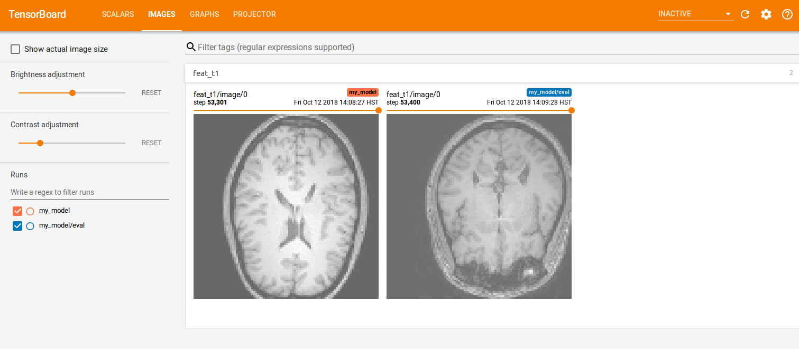

Nifty Assignment: Training a neural network for medical image processing
=======================
# Background


# Meta-information

| Attribute | Explanation |
| ------------- | ------------- |
| Summary | Set-up an environment with TensorFlow and the Deep Learning Tool Kit to train and run inference on sample medical imagesets.  |
| Topics  | Machine Learning, Neural Networks, TensorFlow.  |
| Audience | CS0, CS1 to get their feet wet and introduce concepts, CS2+ for development. |
| Difficulty | Easy to set up and get running, with little room for error.  |
| Strengths | The strength of this assignment is being able to create a training environment quickly. |
| Weaknesses | The topics that the Deep Learning Tool Kit and TensorFlow require are hard to digest and understand. | 
| Dependencies | Requires understanding of Machine Learning training models and understanding of visual data. |
| Variants | Advanced Machine Learning classes may delve into the source code of the training models. |

# System Requirements

* GNU/Linux system
  * Python 2 installed - DLTK highly recommends Python 3, but you may come across erros when installing tensorflow-gpu
    * Pip is installed
    * virtualenv is installed
* NVIDIA GPU for faster training that supports CUDA
* Plenty of hard drive space, as DLTK uses training sets large in file size

# Assignment instructions
## Setting up DLTK
1. Clone the DLTK git repository
   ```shell
   git clone https://github.com/DLTK/DLTK.git
   ```
2. Navigate to the DLTK folder
   ```shell
   cd DLTK
   ```
   
3. Create a virtual python environment
   ```shell
   virtualenv -p python2 venv_tf
   ```

4. Activate the virtual environment
   ```shell
   source venv_tf/bin/activate
   ```

5. Install the dependencies for DLTK within the virtual environment
   ```shell
   pip install -e .
   ```

6. Install tensorflow
   ```shell
   pip install tensorflow-gpu==1.4.0
   ```

## Downloading the IXI data sets for training

   For more information on the IXI dataset, visit https://brain-development.org/ixi-dataset/

1. Go to the IXI_HH folder under data
   ```shell
   cd DLTK/data/IXI_HH
   ```

2. Run the download script
   ```shell
   python download_IXI_HH.py
   ```
   Note that the download may take a long time and may need to be left overnight depending on your internet connetion.

## Start training
### IXI_HH sex classification using resnet

*Note: Any time you are training or inferencing, make sure the python virtual environment is enabled*
   ```shell
   source DLTK/venv_tf/bin/activate
   ```

1. Go to the IXI_HH_sex_classification folder
   ```shell
   cd DLTK/examples/applications/IXI_HH_sex_classification
   ```

2. Create a folder to keep your model progress in
   ```shell
   mkdir my_model
   ```

3. Begin training
   ```shell
   python train.py --verbose --cuda_devices 0 --model_path my_model

4. Start up TensorBoard to observe the training progress
   ```shell
   tensorboard --logdir .
   ```

5. Open a browser to access Tensorboard, by default, Tensorboard opens on port 6006
   ```shell
   http://localhost:6006
   ```

## Tensorboard interface

### Accuracy and Loss graphs


### Image evaluation



### t-SNE graphs
*For information on how to effectively understand t-SNE graphs, see the following Distill entry: https://distill.pub/2016/misread-tsne/


## Inference

By default, inference runs on random images from the data set and infers whether they are male or female.
   ```shell
   python -u deploy.py --model_path my_model
   ```


# Credits
